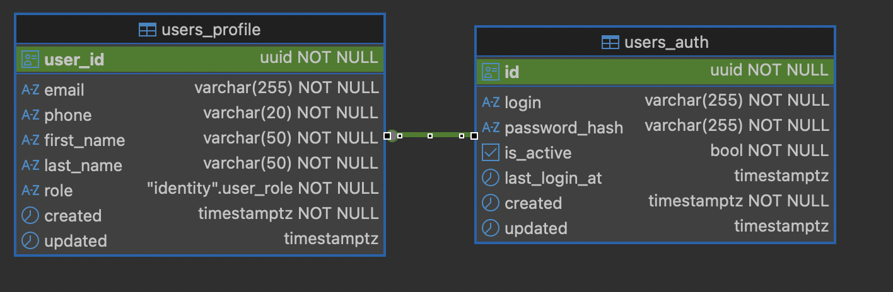
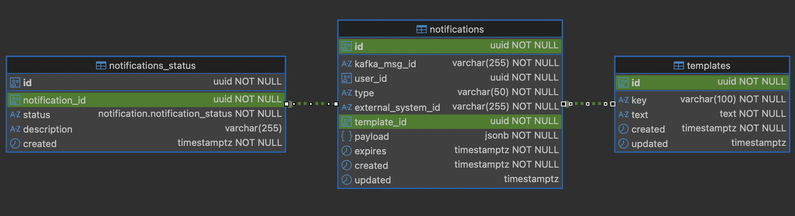

# Домашнее задание 03: Проектирование и оптимизация реляционной базы данных

## Описание изменений

В рамках архитектуры, схема которой представлена в hw1 папке, реляционная БД PostgreSQL используется двумя сервисами - Identity Service и Notification Service.

В рамках выполнения данной ЛР были спроектированы схемы БД для Identity Service и Notification Service, написаны запросы INSERT на наполнение таблиц БД, а также написаны запросы INSERT/SELECT для выполнения действий в рамках ЗО сервисов.

Кроме этого, была выполнена интеграция созданной БД PostgreSQL в Identity Service.

## Описание схем БД
### Identity Service
#### ER


#### Описание схемы

**SQL запросы на создание таблиц, констрейнтов, индексов:** [schema.sql](identity-service/db/schema.sql)

##### Таблица 1 - users_auth

**Назначение:** Хранение учётных данных для входа в систему.

**Поля:**
1. id (UUID, NOT NULL, PRIMARY KEY, DEFAULT gen_random_uuid())\
Первичный ключ, автоматически генерируемый UUID
2. login (VARCHAR(255), NOT NULL, UNIQUE)\
Уникальный логин пользователя
3. password_hash (VARCHAR(255), NOT NULL)\
Хеш пароля в формате bcrypt - минимум 60 символов
4. is_active (BOOLEAN, NOT NULL, DEFAULT TRUE)\
Статус учётной записи - активна/не активна
5. last_login_at (TIMESTAMPT WITH TIME ZONE, NULL)\
Дата и время последнего входа в систему
6. created (TIMESTAMPT WITH TIME ZONE, NOT NULL, DEFAULT CURRENT_TIMESTAMP)\
Дата и время создания записи
7. updated (TIMESTAMPT WITH TIME ZONE, NULL)\
Дата и время последнего обновления записи

**Ограничения:**
1. PRIMARY KEY (id)
2. UNIQUE (login)
3. CHECK (char_length(password_hash) >= 60)

##### Таблица 2 - users_profile

**Назначение:** Хранение персональных данных пользователя.

**Поля:**
1. user_id (UUID, NOT NULL, PRIMARY KEY)\
Первичный ключ, одновременно внешний ключ на users_auth.id
2. email (VARCHAR(255), NOT NULL, UNIQUE)\
Уникальный адрес электронной почты
3. phone (VARCHAR(20), NOT NULL, UNIQUE)\
Уникальный номер телефона в формате E.164
4. first_name (VARCHAR(50), NOT NULL)\
Имя пользователя
5. last_name (VARCHAR(50), NOT NULL)\
Фамилия пользователя
6. role (ENUM user_role, NOT NULL, DEFAULT 'user')\
Роль пользователя - user или admin
7. created (TIMESTAMPT WITH TIME ZONE, NOT NULL, DEFAULT CURRENT_TIMESTAMP)\
Дата и время создания записи
8. updated (TIMESTAMPT WITH TIME ZONE, NULL)\
Дата и время последнего обновления записи

**Ограничения:**
1. PRIMARY KEY (user_id)
2. UNIQUE (email)
3. UNIQUE (phone)
4. FOREIGN KEY (user_id) REFERENCES users_auth(id) ON DELETE CASCADE
5. CHECK (phone ~ '^+[1-9]\d{7,14}$')
6. CHECK (email ~ '^[A-Za-z0-9._%+-]+@[A-Za-z0-9.-]+.[A-Za-z]{2,}$')

#### Кастомные типы данных

ENUM - user_role

**Назначение:** Ограничение допустимых типов ролей пользователей.

**Значения:**
1. user - обычный пользователь системы
2. admin - супер-пользователь с полным доступом ко всем методам системы

#### Связи между таблицами
users_auth и users_profile:\
Тип связи - один к одному - users_auth.id связан с users_profile.user_id. При удалении записи из users_auth соответствующая запись в users_profile удаляется автоматически (ON DELETE CASCADE).

#### Индексы

**Индексы таблицы users_auth:**
1. users_auth_pkey (B-tree, PRIMARY KEY)\
Назначение: Поиск по полю id
2. users_auth_login_key (B-tree, UNIQUE)\
Назначение: Поиск по полю login

**Индексы таблицы users_profile:**
1. users_profile_pkey (B-tree, PRIMARY KEY)\
Назначение: Поиск по полю user_id
2. users_profile_email_key (B-tree, UNIQUE)\
Назначение: Поиск по полю email
3. users_profile_phone_key (B-tree, UNIQUE)\
Назначение: Поиск по полю phone
4. idx_users_profile_first_name_trgm (GIN)\
Назначение: Поиск по маске имени (ILIKE)
5. idx_users_profile_last_name_trgm (GIN)\
Назначение: Поиск по маске фамилии (ILIKE)

#### Список запросов, выполняющиеся с таблицами, и их оптимизации

**Список запросов:** [queries.sql](identity-service/db/queries.sql)\
**Текст об оптимизациях запросов:** [optimization.md](identity-service/db/optimization.md)
**Файл с INSERT'ами тестовых данных:** [data.sql](identity-service/db/data.sql)

### Notification Service
#### ER


#### Описание схемы

**SQL запросы на создание таблиц, констрейнтов, индексов:** [schema.sql](notification-service/db/schema.sql)

##### Таблица 1 - templates

**Назначение:** Хранение шаблонов уведомлений для различных сценариев (авторизация, сброс пароля, приветствие).

**Поля:**
1. id (UUID, NOT NULL, PRIMARY KEY, DEFAULT gen_random_uuid())\
Первичный ключ, автоматически генерируемый UUID
2. key (VARCHAR(100), NOT NULL, UNIQUE)\
Уникальный код шаблона для программного доступа (например, 'auth_credentials')
3. text (TEXT, NOT NULL)\
Текст шаблона с плейсхолдерами для подстановки данных (например, 'Ваш логин: {{login}}')
4. created (TIMESTAMP WITH TIME ZONE, NOT NULL, DEFAULT CURRENT_TIMESTAMP)\
Дата и время создания записи
5. updated (TIMESTAMP WITH TIME ZONE, NULL)\
Дата и время последнего обновления записи

**Ограничения:**
1. PRIMARY KEY (id)
2. UNIQUE (key)

##### Таблица 2 - notifications

**Назначение:** Хранение очереди уведомлений, ожидающих отправки пользователям через внешние системы (Telegram, Email, SMS).

**Поля:**
1. id (UUID, NOT NULL, PRIMARY KEY, DEFAULT gen_random_uuid())\
Первичный ключ, автоматически генерируемый UUID
2. kafka_msg_id (VARCHAR(255), NOT NULL, UNIQUE)\
Уникальный идентификатор сообщения из Kafka для обеспечения идемпотентности
3. user_id (UUID, NOT NULL)\
Идентификатор пользователя-получателя в системе MAX Disk 360
4. type (VARCHAR(50), NOT NULL)\
Тип канала доставки - TELEGRAM, EMAIL, SMS
5. external_system_id (VARCHAR(255), NOT NULL)\
Идентификатор получателя во внешней системе
6. template_id (UUID, NOT NULL)\
Внешний ключ на таблицу templates - шаблон для этого уведомления
7. payload (JSONB, NOT NULL)\
Данные для подстановки в шаблон в формате JSON
8. expires (TIMESTAMP WITH TIME ZONE, NOT NULL)\
Дедлайн отправки - после этого времени уведомление теряет актуальность
9. created (TIMESTAMP WITH TIME ZONE, NOT NULL, DEFAULT CURRENT_TIMESTAMP)\
Дата и время создания записи
10. updated (TIMESTAMP WITH TIME ZONE, NULL)\
Дата и время последнего обновления записи

**Ограничения:**
1. PRIMARY KEY (id)
2. UNIQUE (kafka_msg_id)
3. FOREIGN KEY (template_id) REFERENCES notification.templates(id)

##### Таблица 3 - notifications_status

**Назначение:** Хранение истории смены статусов для каждого уведомления.

**Поля:**
1. id (UUID, NOT NULL, PRIMARY KEY, DEFAULT gen_random_uuid())\
Первичный ключ, автоматически генерируемый UUID
2. notification_id (UUID, NOT NULL)\
Внешний ключ на таблицу notifications - уведомление, к которому относится статус
3. status (ENUM notification_status, NOT NULL)\
Статус уведомления: CREATED (создано), SENT (отправлено), NOT_SENT (ошибка отправки)
4. description (VARCHAR(255), NULL)\
Описание ошибки или причина смены статуса (заполняется для NOT_SENT)
5. created (TIMESTAMP WITH TIME ZONE, NOT NULL, DEFAULT CURRENT_TIMESTAMP)\
Дата и время записи статуса

#### Кастомные типы данных

ENUM - notification_status

**Назначение:** Ограничение допустимых статусов уведомления.

**Значения:**
1. CREATED - уведомление создано и ожидает отправки
2. SENT - уведомление успешно отправлено получателю
3. NOT_SENT - уведомление не отправлено

#### Связи между таблицами

1. templates и notifications:\
Тип связи - один ко многим. Один шаблон может использоваться в множестве уведомлений. При удалении шаблона уведомления не удаляются (ограничение целостности).
2. notifications и notifications_status:\
Тип связи - один ко многим. Одно уведомление может иметь несколько записей статусов - история изменения статусов. При удалении уведомления все связанные статусы удаляются автоматически (ON DELETE CASCADE).

#### Индексы

**Индексы таблицы templates:**
1. templates_pkey (B-tree, PRIMARY KEY)\
Назначение: Поиск по полю id
2. templates_key_key (B-tree, UNIQUE)\
Назначение: Поиск шаблона по уникальному имени
3. idx_templates_id_with_text (B-tree, INCLUDE)\
Назначение: Покрывающий индекс для быстрого доступа к тексту шаблона без обращения к таблице

**Индексы таблицы notifications:**
1. notifications_pkey (B-tree, PRIMARY KEY)\
Назначение: Поиск по полю id
2. notifications_kafka_msg_id_key (B-tree, UNIQUE)\
Назначение: Проверка идемпотентности сообщений из Kafka
3. idx_notifications_expires_created (B-tree, составной)\
Назначение: Индекс для запроса для шедулера для получения активных уведомлений с последним статусом CREATED - фильтр по expires и сортировка по created DESC
1. idx_notifications_template_id (B-tree)\
Назначение: Быстрый JOIN с таблицей templates

**Индексы таблицы notifications_status:**
1. notifications_status_pkey (B-tree, PRIMARY KEY)\
Назначение: Поиск по полю id
2. idx_notifications_status_notification_id_created (B-tree, составной)\
Назначение: Поиск последнего статуса для конкретного уведомления - содержит notification_id и сортировка по created DESC
3. idx_notifications_status_notification_id_created_only (B-tree, частичный, WHERE status = 'CREATED')\
Назначение: Индекс для запроса для шедулера для получения активных уведомлений с последним статусом CREATED — содержит те же поля, что и idx_notifications_status_notification_id_created, но только для статусов CREATED

#### Список запросов, выполняющиеся с таблицами, и их оптимизации

**Список запросов:** [queries.sql](notification-service/db/queries.sql)\
**Текст об оптимизациях запросов:** [optimization.md](notification-service/db/optimization.md)
**Файл с INSERT'ами тестовых данных:** [data.sql](notification-service/db/data.sql)

## Инструкции по запуску

Обе PostgreSQL БД для Identity Service и Notification Service добавлены в [docker-compose.yaml](docker-compose.yaml). Их первичная инициализация (создание схемы и наполнение тестовыми данными) происходит при первичном старте Docker контейнеров. 

Для поднятия всей системы, в том числе обоих БД, достаточно выполнить следующие команды в терминале:
```
git clone https://github.com/lantum1/software-engineering-homeworks.git
cd software-engineering-homeworks/hw3
docker compose up
```